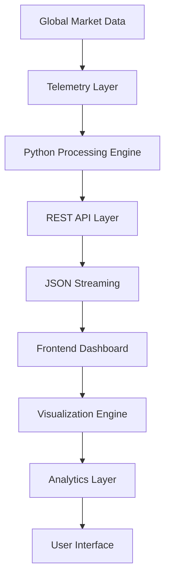

# 🌌 AETHER

### Institutional-Grade Digital Asset Intelligence Platform

<div align="center">


<br>


<br>

### ⚡ Enterprise Digital Asset Monitoring • Real-Time Intelligence • Quantitative Analytics

</div>

---

# 🎯 Overview

AETHER is an advanced institutional-grade market intelligence ecosystem designed for real-time monitoring, quantitative analytics, and digital asset telemetry.

Built with a high-performance Python backend and a modern cyberpunk-inspired visualization layer, AETHER delivers a professional environment for market observation, trend discovery, and data intelligence operations.

---

# 🖼️ Platform Preview

<div align="center">


### Main Intelligence Dashboard

</div>

---

# ✨ Core Highlights

<table>
<tr>
<td width="50%">

### 🚀 Performance Engine

* Ultra-low latency architecture
* Native Python processing layer
* Optimized data pipelines
* Lightweight deployment

</td>

<td width="50%">

### 📈 Market Intelligence

* Real-time asset tracking
* Market movement analysis
* Volume monitoring
* Trend visualization

</td>
</tr>

<tr>
<td width="50%">

### 🔒 Security First

* Minimal dependency architecture
* Reduced attack surface
* Clean API boundaries
* Secure deployment design

</td>

<td width="50%">

### ⚙️ DevOps Ready

* GitHub Actions
* CI/CD pipelines
* Automated validation
* Production workflow support

</td>
</tr>
</table>

---

# 🏗️ System Architecture



---

# 🔥 Technology Stack

<div align="center">

| Layer        | Technology      |
| ------------ | --------------- |
| Backend      | Python 3.11+    |
| API          | HTTPServer      |
| Frontend     | HTML5           |
| Styling      | CSS3            |
| DevOps       | GitHub Actions  |
| Deployment   | Linux / Windows |
| Architecture | Modular         |
| License      | MIT             |

</div>

---

# 🧠 Intelligence Dashboard

```text
╔══════════════════════════════════════════════════════════════╗
║                  AETHER CORE TERMINAL                      ║
╠══════════════════════════════════════════════════════════════╣
║ BTC     │ $67,420.50 │ +4.23% │ Volume: $32.4B             ║
║ ETH     │ $3,512.10  │ +2.81% │ Volume: $18.1B             ║
║ SOL     │ $145.85    │ -1.45% │ Volume: $4.7B              ║
╠══════════════════════════════════════════════════════════════╣
║ Total Market Volume: $56.4B                                ║
╚══════════════════════════════════════════════════════════════╝
```

---

# 📊 Analytics Modules

### Market Tracking

* Live Price Monitoring
* Volume Intelligence
* Asset Ranking
* Historical Analysis

### Visualization Layer

* Animated Dashboards
* Dynamic Charts
* Responsive Layouts
* Dark Mode Interface

### Infrastructure

* API Management
* Data Processing
* Event Monitoring
* Health Tracking

---

# 🎨 UI Design Philosophy

```text
Theme        : Cyberpunk Intelligence Matrix
Mode         : Dark
Layout       : Responsive
Animations   : Hardware Accelerated
Rendering    : High Fidelity
Typography   : Dynamic Scaling
```

---

# ⚙️ Installation

## Clone Repository

```bash
git clone https://github.com/USERNAME/AETHER.git
```

## Enter Directory

```bash
cd AETHER
```

## Start Server

```bash
python app.py
```

## Open Browser

```text
http://localhost:8080
```

---

# 📂 Project Structure

```bash
AETHER/
│
├── app.py
├── index.html
├── styles/
│   ├── main.css
│
├── scripts/
│   ├── dashboard.js
│
├── assets/
│   ├── images/
│
├── .github/
│   ├── workflows/
│
├── LICENSE
└── README.md
```

---

# 📸 Screenshots

<div align="center">

| Dashboard                 | Analytics                 |
| ------------------------- | ------------------------- |
|  |  |

| Market View            | System View            |
| ---------------------- | ---------------------- |
|  |  |

</div>

---

# 🛣️ Development Roadmap

### Version 1.0

* [x] Core Dashboard
* [x] Backend Engine
* [x] API Layer

### Version 2.0

* [ ] Portfolio Tracking
* [ ] Alert System
* [ ] Watchlists

### Version 3.0

* [ ] AI Predictions
* [ ] Machine Learning Insights
* [ ] Institutional Reports

### Version 4.0

* [ ] Multi-Exchange Support
* [ ] Mobile Application
* [ ] Enterprise Cloud Platform

---

# 🤝 Contributing

```bash
Fork Repository
Create Branch
Commit Changes
Push Branch
Open Pull Request
```

---

# ⭐ Support

If you like this project:

⭐ Star the repository

🍴 Fork the repository

📢 Share it with others

---

# 📄 License

Distributed under the MIT License.

See LICENSE for complete information.

---

<div align="center">

## 👨‍💻 Developed By

# Vishwajeet

### Building Modern, Scalable & High-Performance Software


</div>
